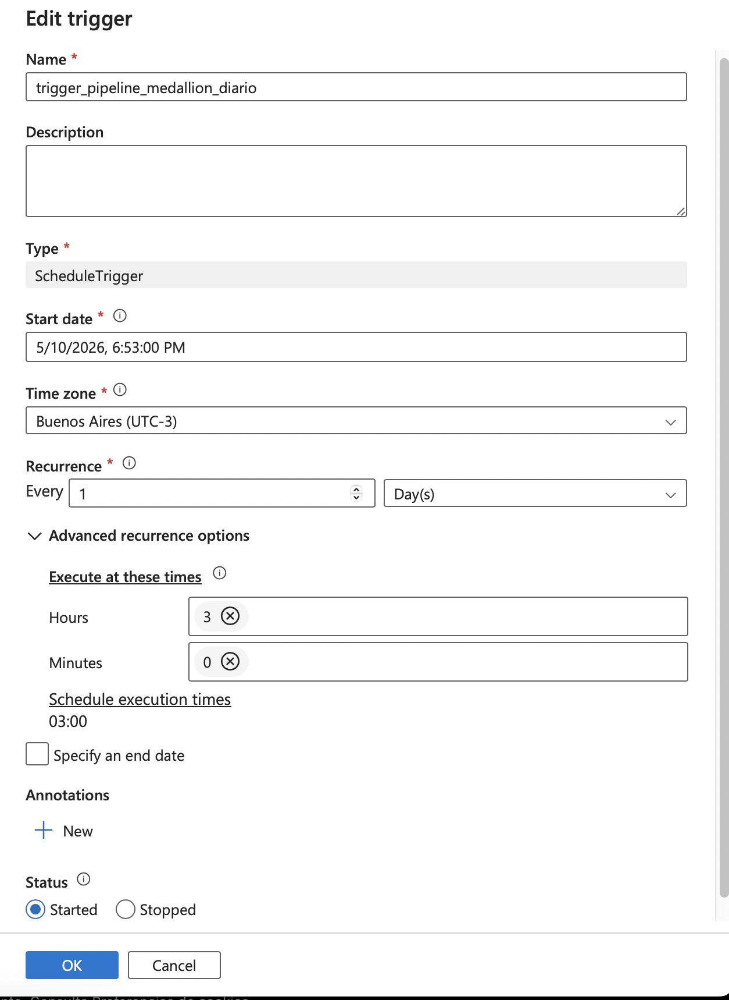
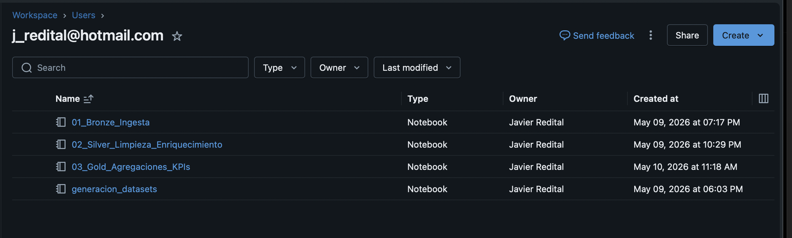
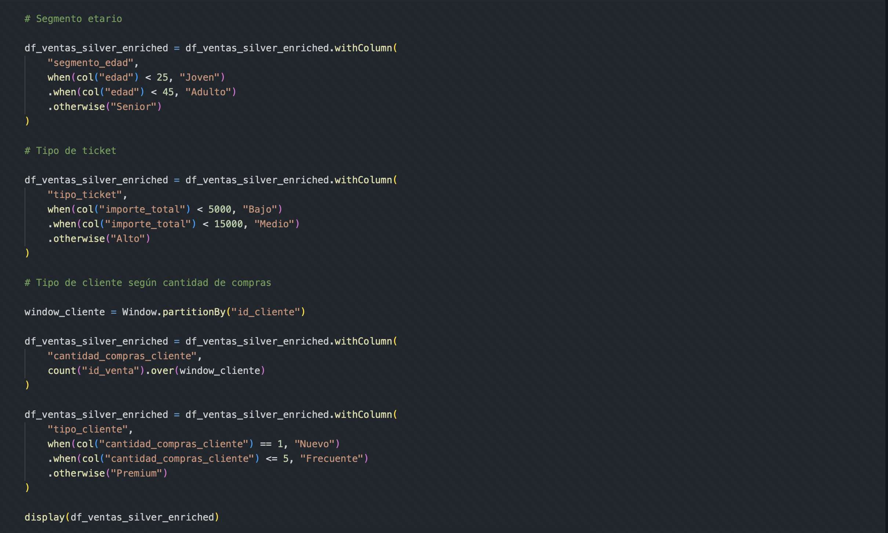

# Pipeline de Datos — Arquitectura Medallion en Azure


## Descripción del proyecto

Este proyecto implementa un pipeline de datos end-to-end utilizando servicios del ecosistema Azure y arquitectura Medallion. La solución permite integrar información proveniente de múltiples fuentes, aplicar procesos de limpieza y validación, enriquecer los datos y generar tablas analíticas orientadas a negocio.

El escenario desarrollado simula un entorno empresarial donde la información se encuentra distribuida entre archivos CSV y una base de datos SQL, dificultando el análisis consolidado y la generación de indicadores confiables.

## Tecnologías utilizadas

- **Azure Blob Storage** — almacenamiento de archivos fuente y capas del pipeline
- **Azure Data Factory** — orquestación y automatización del pipeline
- **Azure Databricks** — procesamiento distribuido mediante PySpark
- **Delta Lake** — formato de almacenamiento estructurado
- **PySpark y Spark SQL** — transformaciones, validaciones y agregaciones analíticas

## Arquitectura

El pipeline implementa una arquitectura Medallion basada en múltiples capas:

| Capa | Descripción |
|------|-------------|
| 🟤 Bronze | Ingesta y almacenamiento inicial de datos |
| ⚪ Silver | Limpieza, validación, enriquecimiento y reglas de calidad |
| 🔴 Rejected | Almacenamiento de registros inválidos |
| 🟡 Gold | Agregaciones y métricas analíticas finales |

## Estructura del repositorio

```text
pipeline_medallion_azure/
├── notebooks/
│   ├── 00_Generacion_Datasets.ipynb
│   ├── 01_Bronze_Ingesta.ipynb
│   ├── 02_Silver_Limpieza_Enriquecimiento.ipynb
│   └── 03_Gold_Agregaciones_KPIs.ipynb
├── data/
│   └── sample/
├── docs/
│   ├── documento_funcional.md
│   └── Informe_Final.pdf
├── architecture.png
└── README.md
```

## Validaciones implementadas

El notebook Silver implementa reglas de calidad de datos orientadas a mejorar la confiabilidad de la información:

1. Validación de productos existentes
2. Validación de cantidades vendidas
3. Detección de registros duplicados
4. Consolidación automática de registros rechazados
5. Generación de variables derivadas para análisis de negocio

Los registros inválidos no son eliminados. Son almacenados en una capa Rejected para mantener trazabilidad y permitir auditorías posteriores.

## Resultados

### Ejecución completa del pipeline


### Trigger automático

El pipeline fue configurado para ejecutarse automáticamente mediante Azure Data Factory.



### Desarrollo de notebooks



### Capa Bronze

Carga y almacenamiento inicial de información.


Verificación de archivos almacenados.


### Capa Silver

Registros rechazados identificados durante las validaciones.


Columnas derivadas utilizadas para segmentaciones de negocio.



Métricas finales de calidad de datos.


### Capa Gold

Tabla analítica por segmento etario.


Escritura de tablas Delta finales.


Verificación de almacenamiento.


Visualización final de resultados.


## Resultados obtenidos

- Registros válidos procesados correctamente: 2000
- Registros rechazados detectados: 2
- Registros duplicados identificados: 2
- Productos inválidos detectados: 1
- Registros con cantidades inválidas: 2

## Documentación

El informe funcional y técnico completo del proyecto se encuentra disponible en:

[Informe Final](docs/Informe_Final.pdf)

## Cómo configurar el proyecto

1. Clonar el repositorio
2. Crear contenedores en Azure Blob Storage
3. Reemplazar credenciales de ejemplo:
   - `TU_KEY_AQUI`
   - `TU_USUARIO_AQUI`
   - `TU_PASSWORD_AQUI`
4. Ejecutar notebooks en el siguiente orden:

- 00_Generacion_Datasets
- 01_Bronze_Ingesta
- 02_Silver_Limpieza_Enriquecimiento
- 03_Gold_Agregaciones_KPIs

## Autor

**Javier Redital**

https://reditaljavier.com
